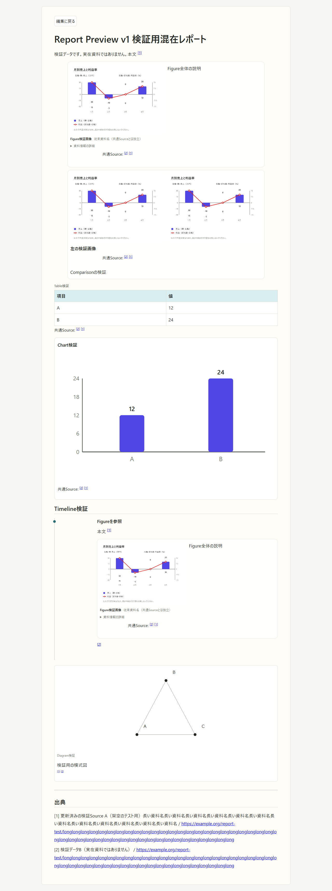
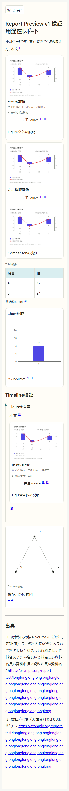

# Report Preview v1 前半：Figure・Comparison・Table・Chartの共通Source

対象基準はmain 1a0b9a1d5aed8f9f0cbbd08b411207bbf6655d3d（Figure #329、Report Preview #331、Citation #333、Comparison #335、Timeline #337、Diagram #338がマージ済み）。図番号・表番号、全体デザイン変更、PDF・印刷専用処理はこのPRに含まない。

## 保存と編集

- Source本体は従来のメモ内 sources-v1 マーカーのみ。参照は安定IDの任意配列 citationIds。同じIDは一度だけ、配列順は維持し、登録されていない有効IDも保持する。番号は保存しない。
- Figure metadataの caption、dateLabel、sourceName、sourceUrl、sourceType、license、note は従来どおり画像に属する。citationIdsを持つ場合だけversion 2とする。解除後は従来情報を保持してversion 1へ戻す。旧画像は読込だけではマーカーを追加しない。
- Comparisonは既存Image Blockの2画像であり、比較全体にSourceを保存しない。画像オブジェクトの入替と同時に参照も入れ替える。片方の削除で残る画像情報は保持し、再追加した画像へ前画像のSourceを付けない。通常表示切替でも参照を保つ。
- 構造化TableとChartは既存version 1の任意citationIds。普通のMarkdown表を変換しない。Tableのnoteと共通引用は独立する。セル・行列・系列・並べ替え・種類変更にSourceを維持する。
- Table→Chartは作成開始時の配列をコピーする。変換確定前は既存draftに一時保持し、取消は本文を変えない。確定後の表編集へ追従しない。表とChartのSourceを別々に解除できる。
- Figureの資料情報編集とTable/Chartの共通Source選択は、保存まで本文・日時・保存予約・履歴を変えない。Sourceがない理由と「編集を取消して出典を管理」導線を表示する。管理への移動は編集中の選択を取り消す。
- 保存は既存本文・revision・updatedAt・保存キュー・Undo/Redoを使い、1回の保存は1回のUndo。無変更保存は原文のまま。元メモ・元本文・Chart draftが変わった選択ダイアログは上書きしない。
- 同一ID・同一全文のコピーは選択した出現だけを編集。Source・説明アンカーの除去後の表示offsetは編集に使わず、出現順で実本文ブロックへ対応させる。既存Figure ID競合解消は維持する。

## 引用順と表示

通常PreviewとReport Previewは同じ描画コンテキストを使う。上から表示順で初めて登場した登録済みSourceに1から番号を与える。同じSourceは同じ番号、末尾一覧は一度だけ、未参照Sourceは表示しない。

|表示単位|初出の順序|
|---|---|
|本文|引用が描画される順|
|Figure / Comparison|画像の並び順、それぞれのcitationIds順|
|Table / Chart|そのブロックのcitationIds順|
|Timeline|項目順、本文→参照Figure→項目citationIds順|
|Diagram|補足本文→citationIds順|

コードフェンス（backtick / tilde）とインラインコードの引用を解釈しない。画像caption・従来資料情報、Tableセル、Chartラベルなど既存のplain textフィールドはCitation構文を解釈しない。無効な構文や未対応情報からSourceを作らない。TimelineのFigureは元Image Blockを毎回参照して描画し、情報をTimelineにコピーしない。参照元が削除またはID競合なら参照先不在を表示する。

共通引用は「共通Source: [番号]」、従来資料情報は従来の資料情報欄に表示する。一致や正否を推測しない。Sourceの表示名・URLの安全判定は既存sourceDisplayLabel / safeSourceUrlを再利用。未登録IDは共通Source欄に「未登録Source: ID」を表示し、番号も一覧項目も作らない。Source編集は全参照に反映し、いずれかの現在本文参照が残れば削除拒否する。通常入力・タイトル入力ごとに新しい全文走査を追加しない。

Report Previewの編集操作は既存read-only処理で非表示・無効化し、閲覧だけでは保存データやUndo/Redoを変更しない。

## 互換性と復元

fixturesには基準mainのFigure/Table/Chart/backup実装をそのままコピーした実行可能ファイルを置く（Sourceユーティリティは追加前のため依存しない）。report-source.test.jsで実行する。

- 旧Figure readerはversion 1へ足したcitationIdsを黙って落とす。version 2なら拒否するため、新規参照はv2で保存する。新readerは不正・未来の資料情報をopaque原文として画像に結び付け、入替・通常表示切替で保持し、未対応情報の編集は拒否する。
- Table/Chartの旧readerは未知任意情報をspreadで保持し、直列化・復元でもcitationIdsを維持する。ブロックversionを変更する根拠はない。既存の未来version・未知項目保持方針も維持する。
- 完全バックアップversion / formatVersionは6へ上げる。旧v5 readerはv6を拒否。v1〜v5の移行は本文を変更せず、未知のv7以降は拒否する。DB schema・storeを変更しない。
- ローカルMarkdownは本文をそのまま保持。Markdown ZIPは添付IDを新しく割り当てるがSource IDとレコードを変えない。完全バックアップは既存の対象メモ単位の置換・競合計画を使い、Sourceを他メモの同名IDへ統合しない。
- Markdown ZIPはversion manifestがないため旧版へ警告拒否できない。旧版が画像ブロックを再編集するとFigure情報・Sourceが失われ得る。対応版でのみ復元・再編集する。Markdown ZIPの既存仕様では未使用添付も末尾に追加されるが、新しいSourceは付かない。

## 検証と画像

report-source.test.jsは複数/空/重複/未登録/不正ID、旧形式、旧parser、直列化と復元、初出順、一覧の重複排除、削除保護、同一出現編集、コード除外、Table→Chart独立コピーを検証する。report-source.e2e.jsは実UIで選択・解除・取消・Undo/Redo・再読込・複製独立編集・画像入替/削除/再追加・Source編集/削除拒否・番号共有・Timeline Figure・通常/Report Preview・PC/320px・実ZIP書出し/復元を検証する。

新E2Eは既存Table CIのChromium/WebKitジョブへ追加し、重複する新CIジョブは作らない。新規画像は e2e-artifacts/report-source-review/<browser>/ に生成してCI artifactへアップロードする。docsのPNGはローカルChromiumで採取した今回の変更のレビュー用スナップショットで、最新headの検証は同じheadのCI結果を参照する。画像内の資料名・URL・グラフ値・画像はすべて検証データで、実在資料を示さない。Safari/iPhone実機は未確認。ローカルWindows WebKitでは添付BlobのIndexedDB保存がUnknownError（Error preparing Blob/File data to be stored in object store）となり、新しい実操作E2Eを完走できない。変更前mainと作業ブランチの両方で同じ失敗を確認した。Ubuntu WebKitは既存CIで検証し、ローカル失敗を成功扱いしない。

PDF/印刷の検証は行っていない。図番号とReport Preview全体の表示調整は今回のマージ後の次PR、PDF出力は別段階。
