# Report Previewの間隔とPDF整合

変更前基準: main da19f1b7e58f259cb5ed5e269cfb9f276f9b2ed1。PDF #343、採番 #345、Source #341、Timeline #337、Diagram #338はいずれもマージ済み。専用ブランチ feature/report-spacing-pdf、worktree work/report-spacing-pdf で実装し、元mainの未コミット・未追跡作業を保持した。

## 判断基準と適用範囲

関連する本体・番号・説明・Sourceは近く、別の組と章の前は離す。既存style.cssのReport専用CSS変数で本文 .85em、章 2em、図表外側 1.65em、内部 .45em、Timeline項目 1.2emを管理する。値は各要素の文字サイズに追従する。連続見出し、先頭・末尾、Timeline内のFigureは局所的に詰める。

画面とPDFは既存の同じPreview DOM・renderPreview・applyReportNumbering・Source rendererを使う。style.cssはbody.report-preview-mode #previewのみに適用し、report-print.cssは通常print media、印刷準備中のみ既存処理でallにする。画面の中央列と本文行間1.8は維持し、図版説明の文字サイズは本文に追従する。既存Markdown見出しは3階層を検証し、対応階層を増やさない。

保存データ・マーカー・番号体系・Source順序・ZIP形式・ライブラリ・設定UIを変更しない。通常プレビューのHTMLをReport終了前後で完全比較し、本文・IndexedDB保存内容・dirty・Undo/Redoも比較する。編集・保存・描画モデルは再実装しない。

## PDFの長い組

A4縦、白背景、上下左右20mm、ページ番号のみ、既存の標準印刷方式とリンク方針を維持する。通常サイズの組は既存の分割回避・次ページ移動、大きな画像主体の図は既存zoomによる等比縮小を維持する。

組自体が1ページより高く、画像が利用可能高の2/3未満、または画像以外が1/3より高い場合は文字主体と判定し、組のbreak-insideをauto、displayをblockにして文字を縮めず流す。画像のない長いTimeline項目も同じ扱い。必要な縮小はメディアだけに適用し、長いキャプションのための確保は最大1/3ページに制限して画像の極小化を防ぐ。一時styleは既存afterprint処理で復元する。

表は既存9pt・行間分割・thead繰返しを使う。画面のスクロール領域は印刷時には既存の可視・固定レイアウトへ切替える。出典一覧はぶら下げ配置と全文URL折返しを使い、任意項目のフィルタと安全URL判定は既存処理をそのまま使う。

## 同じ内容による比較

画面: 1280pxと320px、本文17pxと20px（既存最大サイズ）、light/darkで横幅・番号・Source・全文を確認。実計算された文字サイズもassertする（[画面の計測値](screen-metrics.json)、[PDF検査](pdf-inspection.json)）。画面画像は17px lightで同じ内容・位置を撮影。図中の画像・URL・値は検証用。

| 対象 | 変更前 | 変更後 |
|---|---|---|
| 本文と連続見出し（PC） | 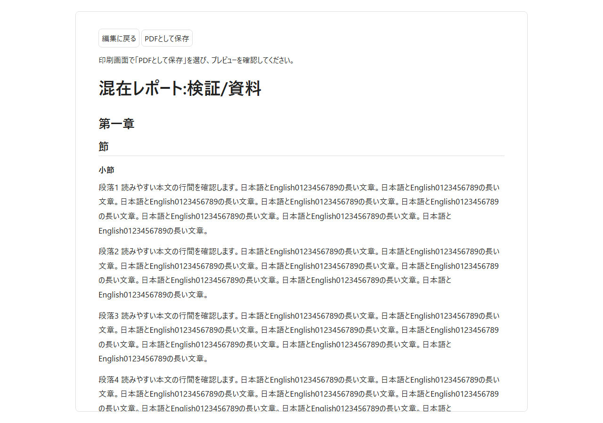 | 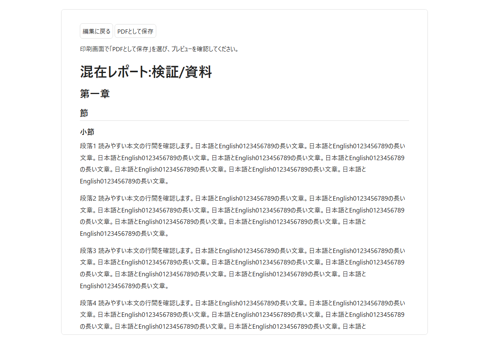 |
| Comparison（320px） | 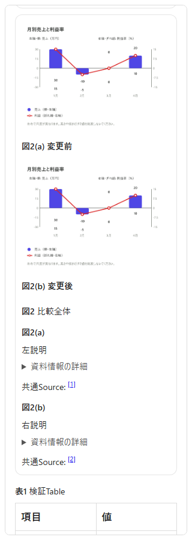 | 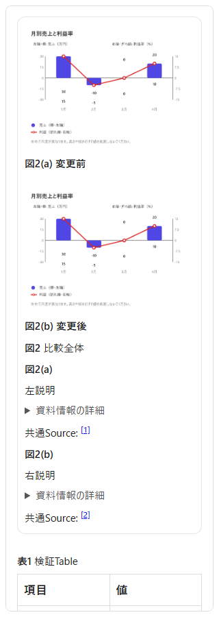 |
| Timeline（320px） | 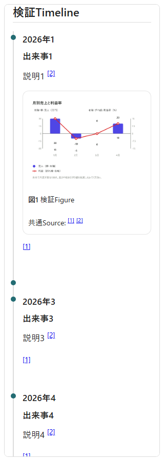 | 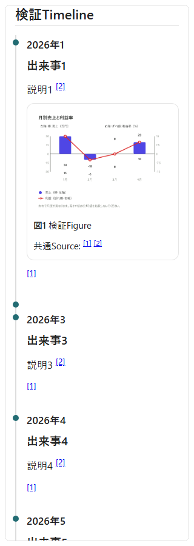 |
| 長文PDF全ページ | 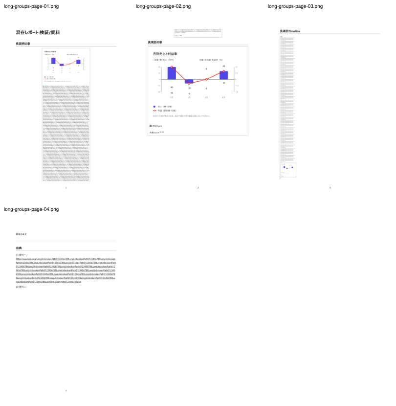 | 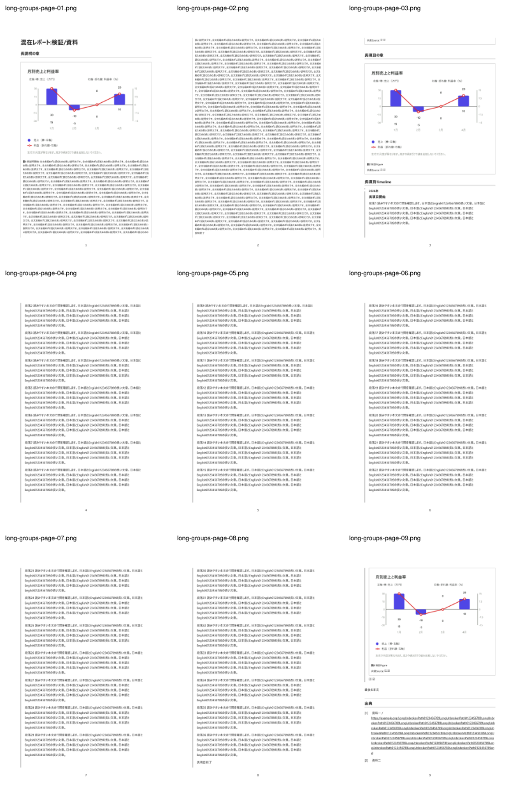 |
| 混在PDF全ページ | 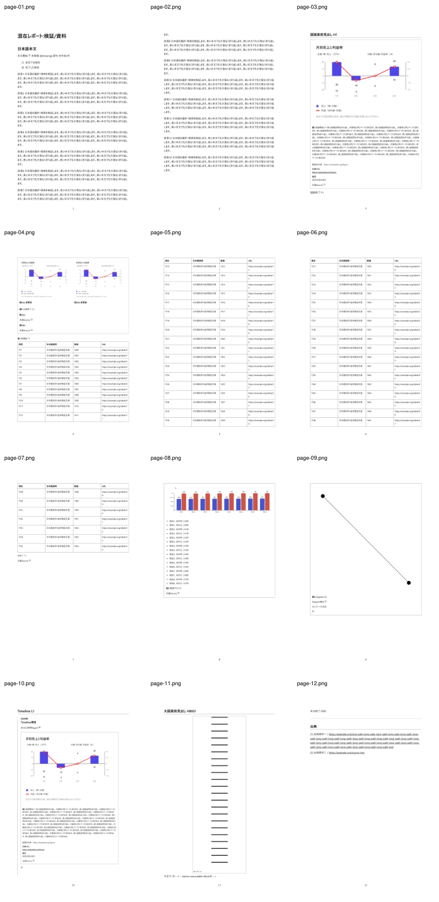 | 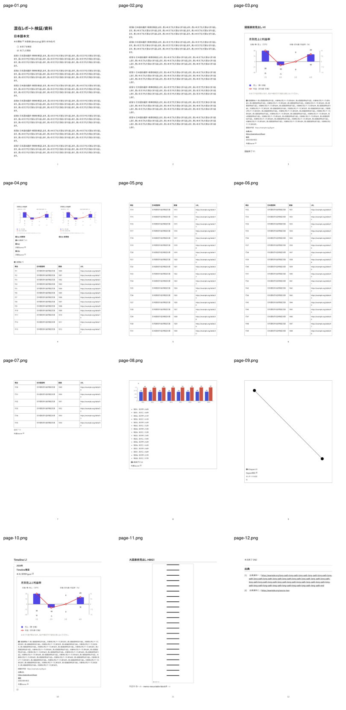 |

長いFigure説明と36段落のTimelineを含むケースは4ページから9ページへ。変更前の最小文字サイズ約1.17ptに対し、変更後は該当本文・キャプションが9pt以上を維持して欠落なく流れる。長文PDFの画像も通常の可読サイズを保つ。円グラフ4ケースは出典一覧まで2ページから1ページへ。図表連続+24項目Timelineは10ページから9ページへ。ページ数を減らすために文字を縮める処理は追加していない。

既存最大20px・darkテーマでのReport白背景も目視確認: [本文320px](screen-prose-20-dark.png)、[Comparison320px](screen-comparison-20-dark.png)。

変更後の長文2ページ目を原寸でも確認: 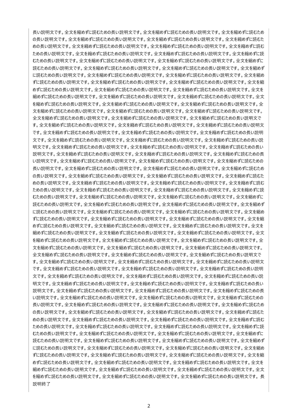

## 検証

- npm test: 1,799件PASS。
- 全JS/CJS構文チェック: 232ファイルPASS。git diff --check PASS。
- 独立したbuild scriptはない静的アプリ。構文チェックとブラウザ読込を配信コードの確認に使う。
- Chromium: Report Preview、Figure、Comparison、Timeline、Diagram、Source、Tableの既存E2E PASS。WebKitのSource E2EもPASS（既存の永続プロファイルでPC/320px、実ZIP復元）。Chart E2Eも26機能すべてPASS（960.1秒、PNG/SVG/Clipboard/値表/Table変換/タッチエミュレーションを含む）。
- Report PDF E2E: PC/320px由来の混在PDF各12ページ、Comparison/pie/単一Figureの10ケース実PDF、追加の4レポート（長文/連続見出し、図表連続+長いTimeline、長い説明とTimeline項目、任意項目なし）PASS。
- PyMuPDFで全文、番号、図版・説明の同一ページ、画像比率、9pt以上の長文、表55行の全数値・行保持・見出し繰返し、Timeline24項目、ページ余白、外部URL注釈と全文を検査。全ページPNGと主要画面を目視確認。
- 縮小/分割判定の単体回帰は長文Figure、画像なしTimeline、長い説明による画像極小化と復元を検証する。

再現: npm ci後、python -m pip install pymupdf==1.27.2、npm run test:e2e:report-pdf。WindowsではPYTHONに利用するPython実行ファイルを指定。Linuxではfonts-noto-cjkも必要。既存CI Figure jobが追加ケースを実行し、report-pdf-review artifactへPDF・全ページPNG・metrics.json・inspection.json・spacing/cases.jsonを保存する。変更前画像の採取には同じhelperを基準mainの隔離worktreeに配置してbaselineモードを用いた。

## 制約・未確認

CSS分割回避はブラウザの絶対保証ではない。多い資料情報を持つComparisonの末尾出典が次ページへ続くケースは変更前後とも再現する。全文とリンクは残り、図本体・番号・個別説明は同じページを維持する。表1行自体が1ページを超える場合、極端な多列や横長SVGの可読性は既存方式の制約。SVG内の軸文字は元の描画サイズに依存するが、Chartデータは9ptの既存テキスト一覧でも読める。

標準印刷画面の実保存・取消、Edge実機、Safari/iPhone/Firefox実機、利用者の印刷余白・倍率・ヘッダー設定上書きは未確認。自動検証の実PDFは同じ印刷準備とCSSにChromium page.pdfを用いる。テーマ確認はReportの既存白背景への切替を含む。
