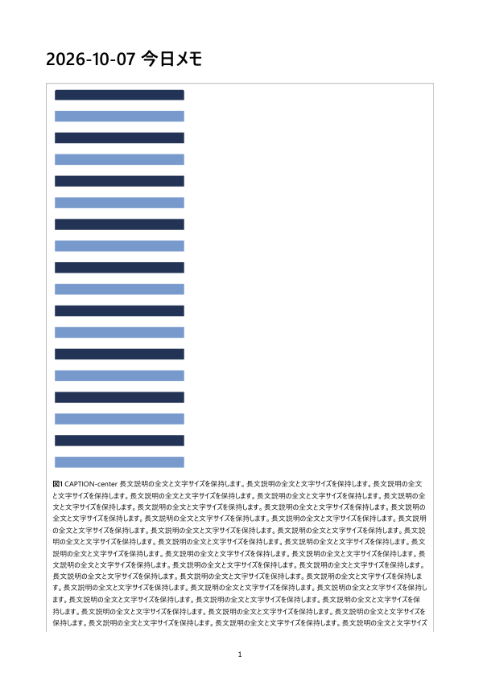
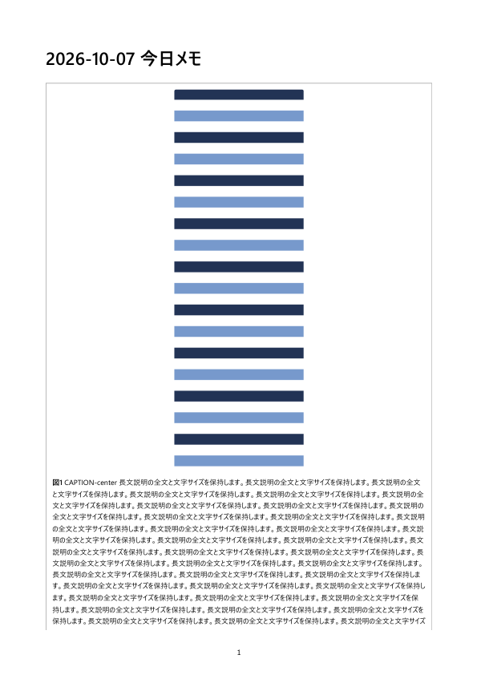
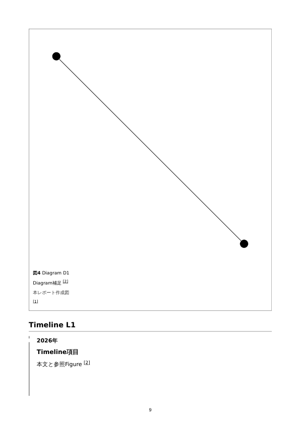
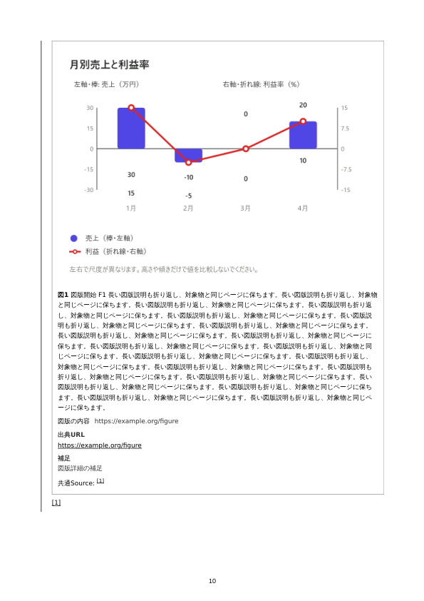
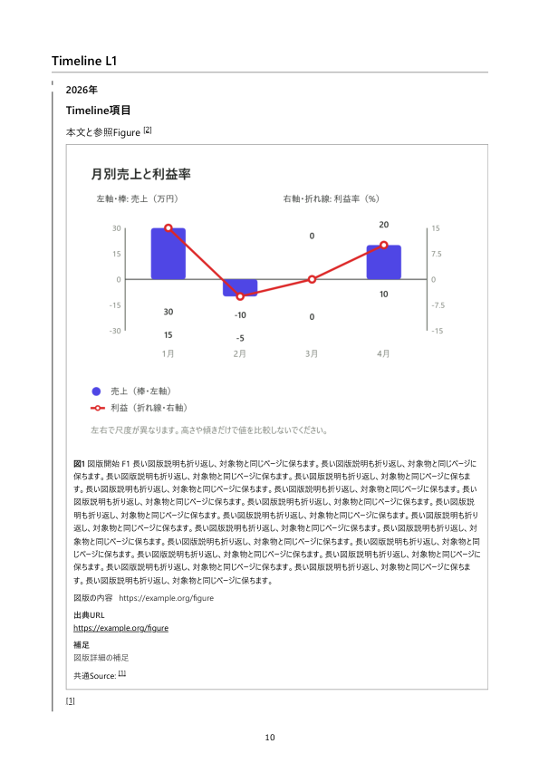
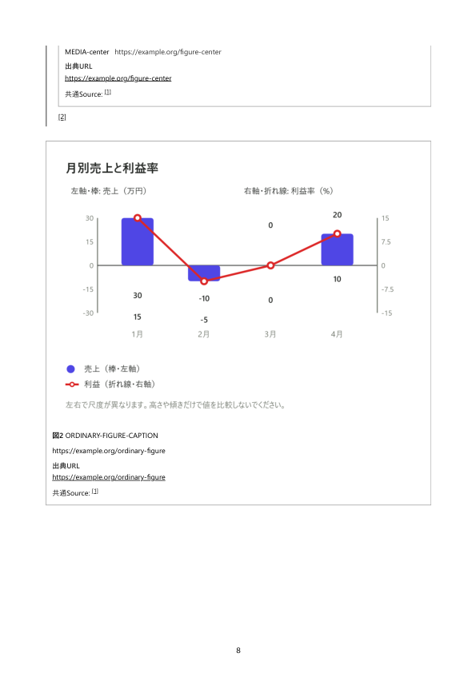

# PR #347 PDF失敗の修正と検証

作業開始時の最新状態は main `da19f1b7e58f259cb5ed5e269cfb9f276f9b2ed1`、PR HEAD `dce3606de7df7a323dadf91d59f3c91f6d37ab36`。元のdirty mainと既存PR作業ツリーを保護し、`fix/report-spacing-pdf-ci` の隔離ツリーで作業した。既存PRの `feature/report-spacing-pdf` に追加commitをpushする。

## 最初の失敗と判断

[失敗ジョブ](https://github.com/tetsujisugimori-coder/memo/actions/runs/37540403612/job/112531740594)のログ・`report-pdf-review`成果物を取得した。最初の失敗は `inspect-pdf.py:68` の `TimelineL1` ページに `[1]` を2個以上要求するassert。対象はデスクトップの `mixed-report.pdf`、9ページ目。

| 同一混在入力の出力 | Timeline章見出し・日時・項目見出し・本文 | 参照図1・キャプション・Figure出典・項目出典 |
| --- | --- | --- |
| 指定mainのLinux CI 37533805665 | 10ページ | 10ページ |
| PR dce3606の失敗Linux CI | 9ページ | 10ページ |
| 修正後のWindows Chromium | 10ページ | 10ページ |

mainのTimeline項目は全体zoom約0.870、表示高890.55px。失敗PRはzoomなし、高973.38pxで、A4本文領域約971.34pxをわずかに超えて長文用の分割へ入った。9ページ目の `[1]` は直前Diagramの出典で、TimelineのFigure出典ではない。画像・キャプション・出典の消失はなく、本文との改ページが原因だった。

初回修正 `e5d3e70…` の[CI](https://github.com/tetsujisugimori-coder/memo/actions/runs/37588694669)ではPCのPDFと追加全6ケースは成功し、320pxの混在PDFで通常Timelineが10/11ページに分離した。画面用600px以下のルールが左paddingを1.3em→1emに変え、測定時の本文幅と実A4印刷時の幅が異なっていた。印刷だけpaddingを固定し、320pxのmetricsはPC値のコピーをやめて実測へ変更。両方の項目高とメディア幅/高さの一致を検査する。

指定mainのPDF成果物も直接取得して照合した。main / 失敗PR / 修正出力で `reportNumbers`、`citations`、`longUrl` が一致する。Windowsでも同じ入力をmainと修正ツリーで生成した。Linuxの修正出力はpush後CIの成果物で追加検査する。古いSHAの成功を修正HEADの成功として扱わない。

通常項目を保持する描画修正と、誤ったSourceの個数で判断しない検査更新の両方を行った。通常項目は固有本文・図番号/キャプション・資料情報・Figure出典・項目出典を同じ項目領域で照合する。長文項目は30段落の全文、参照Figureの2つの実画像、キャプション全文、固有URLとSourceを対応づけ、許容する分割を検査する。

## 描画修正

- ページを少し超える通常項目と、短い説明を伴う大きな図は、本文・キャプションを縮めずメディアだけを縮小する。見出し分を予約し、画像比率を保持する。
- 長文は元の文字サイズで複数ページへ流す。長文Timeline内の参照Figure自体も1ページを超える場合、印刷中だけgridからblockへ変えて分割する。
- メディア縮小時に配置分の余白を補正する。グループの文字サイズは変更しない。
- 1ページに収まるSource欄だけ印刷中に一体として扱う。大きいSource欄は分割可能なままにする。画面用の画像ブロックの `overflow:hidden` は印刷だけ解除する。
- ChromiumはCSSOMの空styleを遅延同期して、単に属性を削除すると `style=""` を再生成するケースがある。同期してから削除し、属性・配置を完全復元する。

A4縦・白背景・20mm・ページ番号のみ、外部URL注釈、内部リンクの移動を止める既存方針、採番・保存形式を維持する。編集/通常Preview/ZIP/設定/依存ライブラリの変更はない。画面の余白基準と比較は [既存の間隔検証](../README.md) を参照。

## メディア単独縮小の実測

600×1800画像と180回の長い説明、30段落のTimelineで、実際にメディア単独zoom約0.358へ入る入力を使った。同一入力・Windows Chromiumで縮小後のメディア領域を測定した（CSS px）。画像の比率は1:3、キャプションは12px=9pt、親グループzoomはなし。

| 配置 | 変更前・外側メディアの左/中心/右 | 変更後・外側メディアの左/中心/右 | 変更後Timeline内の左/中心/右 |
| --- | --- | --- | --- |
| 左 | 11 / 121.92 / 232.84 | 11 / 121.92 / 232.84 | 32.06 / 139.32 / 246.58 |
| 中央 | 11 / 121.92 / 232.84 | 210.33 / 321.25 / 432.17 | 224.52 / 331.77 / 439.03 |
| 右 | 11 / 121.92 / 232.84 | 409.66 / 520.58 / 631.50 | 416.98 / 524.24 / 631.50 |

中央画像の中心は外側321.242px（期待321.258）、Timeline内331.773px（期待331.789）。約199px / 192pxの左寄りが、誤差0.02px未満になった。回帰検査では親の内容領域から独立に期待配置を求め、PC/320pxで左右中央を検査する。

| 同一入力の大画像・長説明PDF | 変更前 | 変更後 |
| --- | --- | --- |
| Windows・中央配置 |  |  |

| Timeline分離の実PDF | 失敗Linux・9ページ | 失敗Linux・10ページ | 修正Windows・10ページ |
| --- | --- | --- | --- |
| 日時/本文と参照Figure |  |  |  |

後者の画像はOSが異なることを明示する。最終Linux出力は修正HEADのCI artifactで確認する。

長文TimelineのFigure出典と項目出典：

## 実行した検証

- `npm test`: 1799件成功。並行ブラウザ実行時の別の1回は、未変更の `codex-bridge.test.js` のhealth検査が `UND_ERR_SOCKET / other side closed` で1798成功・1失敗。失敗ログを保存し、並行実行終了後に当該ファイル1回と全体1回を実行して成功した。ソケット失敗の根本原因は未特定で、今回の修正で解消したとは扱わない。
- `npm run test:e2e`: Figure、Comparison、Report Preview、Citation Source、Timeline、Diagram、共通Report Source成功。以前のPDF失敗で未実行だった後続機能も実行した。
- `PYTHON=<PyMuPDF環境> node report-pdf.e2e.js`: PC/320px各12ページの混在PDF、左右中央×PC/320pxの6 PDF、Comparison/Chart/単一Figureの10ケース、間隔の4レポートを生成して検査成功。
- PDFでは余白・ページ番号・全文・55行の表と反復見出し・Chart全データ・Diagram・採番・Source・URL注釈・画像比率/分断・文字サイズを検査。本文/キャプション9pt以上、既存引用番号の .8em も維持して検査する。
- 印刷準備/PDF/afterprint前後に保存内容・保存済みデータ・dirty・Undo/Redo・一時style・画面画像位置を比較して一致。Report番号とcitationも一致。PC/320、17px/20px、light/darkの既存間隔ケースも成功。
- 主要ページとページ一覧を目視した。普通の図、Comparison、表、Chart、Diagram、Timeline内Figure、長い説明、長文項目、大図、Source/長いURLを確認した。
- `git diff --check` と変更JS/CJSの `node --check` 成功。独立build scriptのない静的アプリのため、実ブラウザ起動と構文検査で確認した。

[実測JSON](pagination-metrics.json)、[対象ページの検査結果](pagination-inspection.json)。PDF/全ページPNG/全文入りcases.jsonは `report-pdf-review` CI artifactへ保存する。修正HEADのSHA・全CIジョブ結果はPR説明に記録する。

## 独立した既存グラフ失敗

main da19f1bの `chart-axis-titles`（Chromium）のゼロ軸assert失敗は、10月3日 main `1a0b9a1…` にも同じログがある。過去ログは数値を記録しておらず、当時の期待/実測座標そのものは未確認。

main / PR旧HEAD / PDF修正ツリーで通常ケースを各3回実行し、すべて成功。一方、描画遅延を制御するとmain / PR旧HEADとも3回すべて期待125・実測196で失敗し、SVGの新しい値を待つと3回すべて成功。軸計算を変える必要はなく、古いSVGの取得が原因だった。

別PR [#348](https://github.com/tetsujisugimori-coder/memo/pull/348)、SHA `590d8563426cd7add77da3d6e154bebb2cf50ec1` に、対象項目・系列ID・値titleの描画一致を待つ検査修正を分離した。通常3回、Chromium/WebKit制御各3回、単体1796件成功。[同SHAのCI](https://github.com/tetsujisugimori-coder/memo/actions/runs/37585683371)は通常9ジョブ成功、任意WebKit Inspector診断のみスキップ。PDF側にグラフ修正は含めない。

## 制約

1ページを超える説明は分割する。今回の長文入力では画像/キャプション開始が1・6ページ、キャプション末尾が2・7ページ、直後のSource欄が3・8ページ、通常Timelineが9ページ。無理に一体化して巨大な空白や文字縮小を起こさず、全文とSourceの対応を保持する。

Chromium `page.pdf()` の実出力を確認した。OSの標準保存/取消ダイアログ、Edge/Firefox/Safari/iPhone実機、ユーザーによる印刷倍率・余白変更は未確認。1行自体が1ページを超える表、極端な多列/横長SVGの既存制約は残る。自動マージは行わない。
